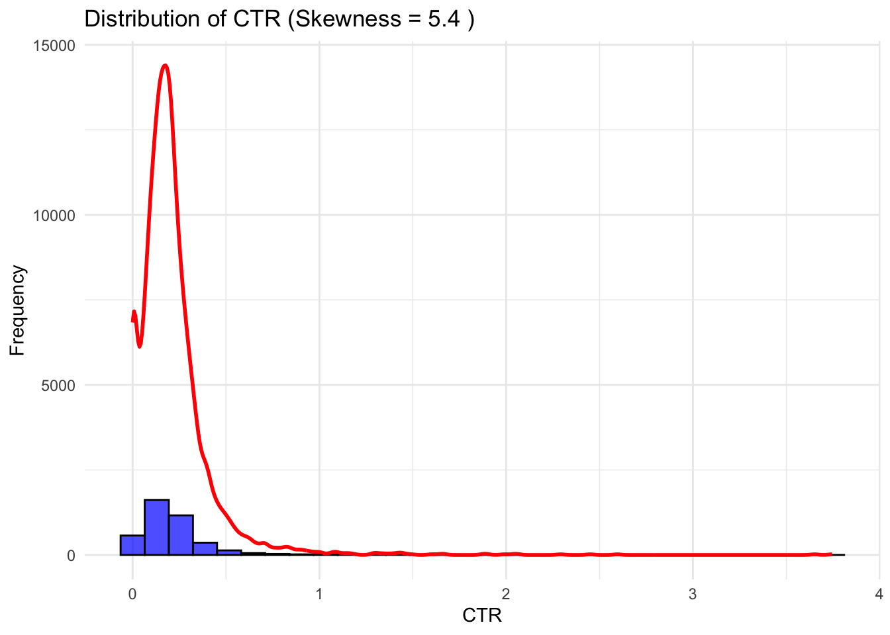
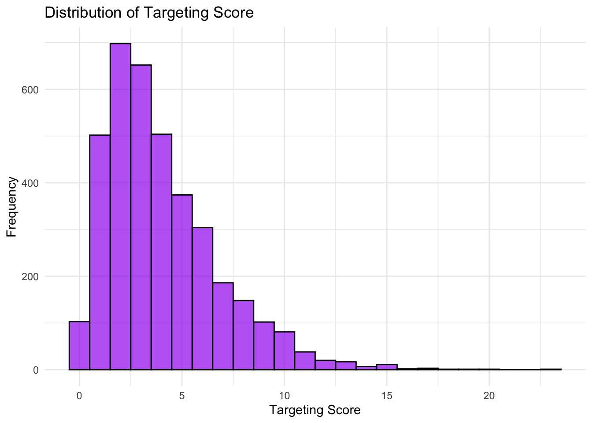
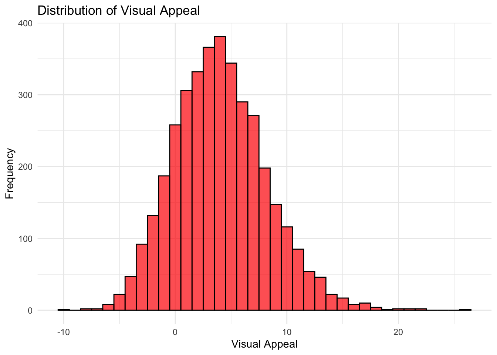
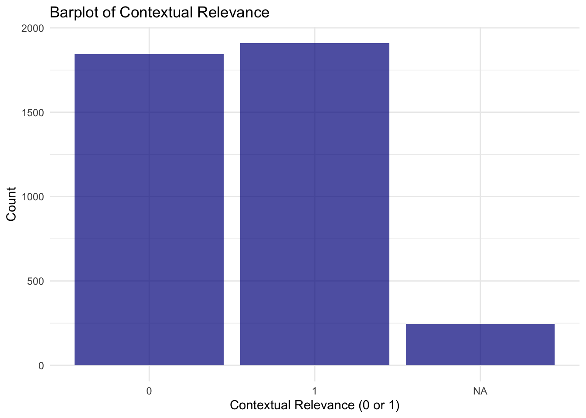
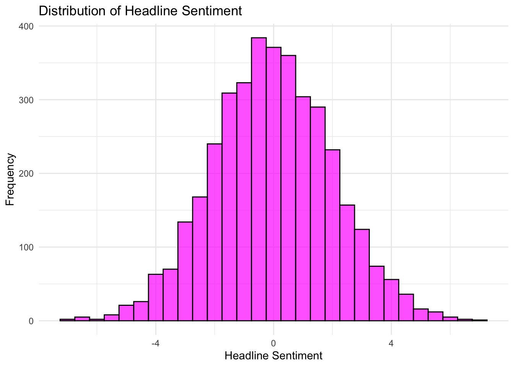
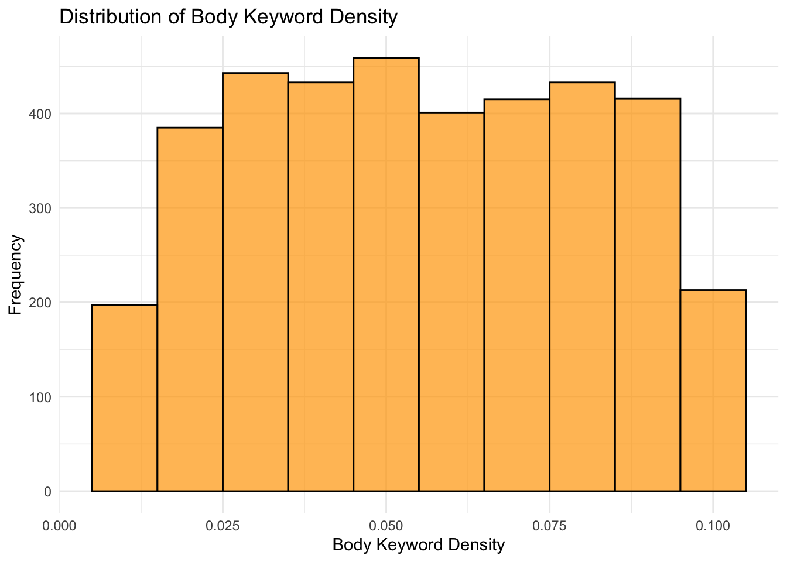
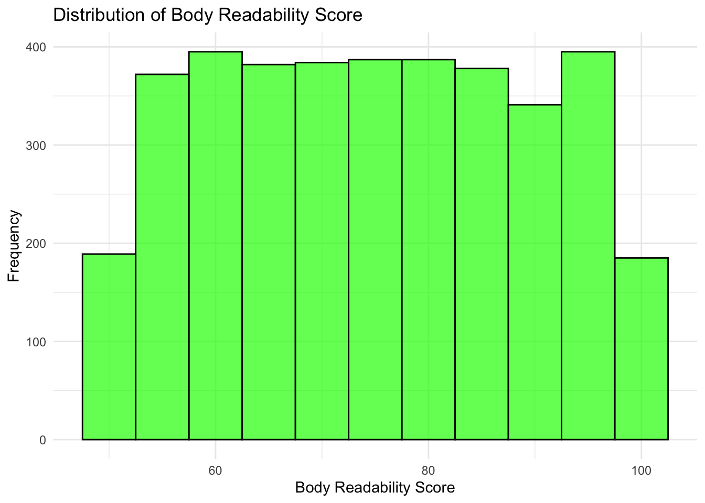
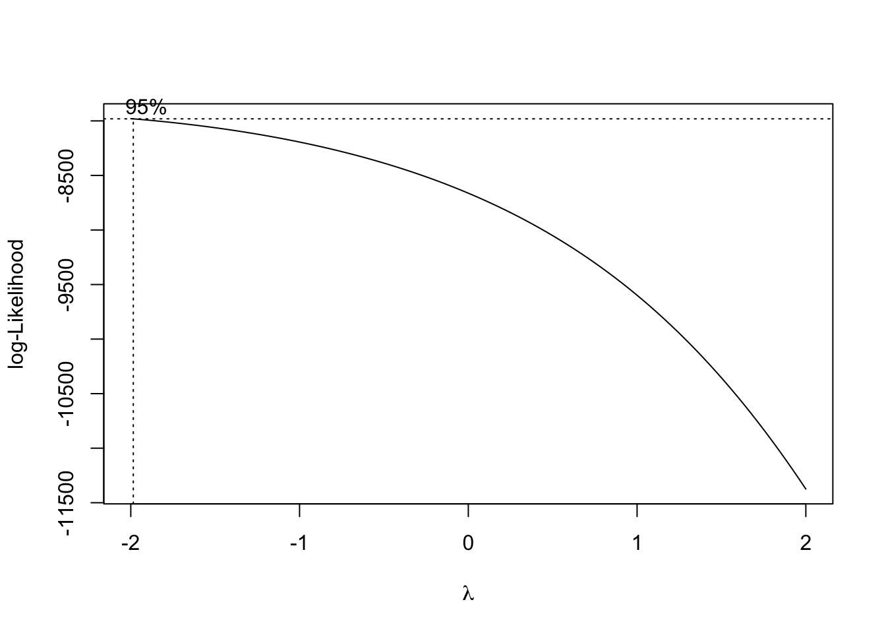

<!DOCTYPE html>
<html xmlns="http://www.w3.org/1999/xhtml" lang="en" xml:lang="en"><head>

<meta charset="utf-8">
<meta name="generator" content="quarto-1.6.39">

<meta name="viewport" content="width=device-width, initial-scale=1.0, user-scalable=yes">

<meta name="author" content="Huan Shuo Hsu">

<link href="PAC Competition_files/libs/bootstrap/bootstrap-icons.css" rel="stylesheet">
<link href="PAC Competition_files/libs/bootstrap/bootstrap-973236bd072d72a04ee9cd82dcc9cb29.min.css" rel="stylesheet" append-hash="true" id="quarto-bootstrap" data-mode="light">

</head>

<body>

  <nav id="TOC" role="doc-toc" class="toc-active">
    <h2 id="toc-title">Table of contents</h2>
   
  <ul>
  <li><a href="#load-data" id="toc-load-data" class="nav-link active" data-scroll-target="#load-data">Load Data</a></li>
  <li><a href="#data-exploration" id="toc-data-exploration" class="nav-link" data-scroll-target="#data-exploration">Data Exploration</a>
  <ul>
  <li><a href="#key-summary" id="toc-key-summary" class="nav-link" data-scroll-target="#key-summary">Key Summary</a></li>
  <li><a href="#ctr-click-through-rate" id="toc-ctr-click-through-rate" class="nav-link" data-scroll-target="#ctr-click-through-rate">CTR (Click Through Rate)</a></li>
  <li><a href="#targeting-score" id="toc-targeting-score" class="nav-link" data-scroll-target="#targeting-score">Targeting Score</a></li>
  <li><a href="#visual-appeal" id="toc-visual-appeal" class="nav-link" data-scroll-target="#visual-appeal">Visual Appeal</a></li>
  <li><a href="#contextual-relevance" id="toc-contextual-relevance" class="nav-link" data-scroll-target="#contextual-relevance">Contextual Relevance</a></li>
  <li><a href="#headline-sentiment" id="toc-headline-sentiment" class="nav-link" data-scroll-target="#headline-sentiment">Headline Sentiment</a></li>
  <li><a href="#body-keyword-density" id="toc-body-keyword-density" class="nav-link" data-scroll-target="#body-keyword-density">Body Keyword Density</a></li>
  <li><a href="#body-readability-score" id="toc-body-readability-score" class="nav-link" data-scroll-target="#body-readability-score">Body Readability Score</a></li>
  </ul></li>
  <li><a href="#data-cleaining" id="toc-data-cleaining" class="nav-link" data-scroll-target="#data-cleaining">Data Cleaining</a>
  <ul>
  <li><a href="#handling-skewness-of-ctr" id="toc-handling-skewness-of-ctr" class="nav-link" data-scroll-target="#handling-skewness-of-ctr">Handling Skewness of CTR</a></li>
  <li><a href="#separating-columns-by-data-type" id="toc-separating-columns-by-data-type" class="nav-link" data-scroll-target="#separating-columns-by-data-type">Separating Columns by Data Type</a></li>
  <li><a href="#imputing-missing-values" id="toc-imputing-missing-values" class="nav-link" data-scroll-target="#imputing-missing-values">Imputing Missing Values</a></li>
  <li><a href="#feature-selection" id="toc-feature-selection" class="nav-link" data-scroll-target="#feature-selection">Feature Selection</a></li>
  </ul></li>
  <li><a href="#xgboost" id="toc-xgboost" class="nav-link" data-scroll-target="#xgboost">XGBoost</a>
  <ul>
  <li><a href="#cross-validation" id="toc-cross-validation" class="nav-link" data-scroll-target="#cross-validation">Cross Validation</a></li>
  <li><a href="#hyperparameter-tuning" id="toc-hyperparameter-tuning" class="nav-link" data-scroll-target="#hyperparameter-tuning">Hyperparameter Tuning</a></li>
  </ul></li>
  <li><a href="#prediction" id="toc-prediction" class="nav-link" data-scroll-target="#prediction">Prediction</a></li>
  <li><a href="#final-comment" id="toc-final-comment" class="nav-link" data-scroll-target="#final-comment">Final Comment</a></li>
  </ul>
</nav>

<main class="content" id="quarto-document-content">

<header id="title-block-header" class="quarto-title-block default">

<h1 class="title">PAC Competition</h1>

    

    
Author

    

             
Huan Shuo Hsu 

          

  

    
  
    
  

  

</header>

<section id="load-data" class="level1">
<h1>Load Data</h1>

The provided dataset <code>analsysis_data</code> will be the train set, and <code>scoring_data</code> will be the test set.

<pre class="sourceCode r code-with-copy"><code class="sourceCode r"># --- Load Required Libraries ---
library(dplyr)
library(caret)

# --- Load Data ---
train &lt;- read.csv("analysis_data.csv")
test &lt;- read.csv("scoring_data.csv")</code><button title="Copy to Clipboard" class="code-copy-button"><i class="bi"></i></button></pre>

</section>
<section id="data-exploration" class="level1">
<h1>Data Exploration</h1>

To begin the analysis, the <code>skim</code> function is used from the <strong>skimr</strong> package to gain an overview of the dataset. This function provides a summary of each variable, including its distribution, data type, and completeness. We will then pick out a few important variables base on domain knowledge and take a deeper dive into their structure.

<pre class="sourceCode r code-with-copy"><code class="sourceCode r">library(skimr)
skim(train)</code><button title="Copy to Clipboard" class="code-copy-button"><i class="bi"></i></button></pre>

<table class="caption-top table table-sm table-striped small">
<caption>Data summary</caption>
<tbody>
<tr class="odd">
<td style="text-align: left;">Name</td>
<td style="text-align: left;">train</td>
</tr>
<tr class="even">
<td style="text-align: left;">Number of rows</td>
<td style="text-align: left;">4000</td>
</tr>
<tr class="odd">
<td style="text-align: left;">Number of columns</td>
<td style="text-align: left;">29</td>
</tr>
<tr class="even">
<td style="text-align: left;">_______________________</td>
<td style="text-align: left;"></td>
</tr>
<tr class="odd">
<td style="text-align: left;">Column type frequency:</td>
<td style="text-align: left;"></td>
</tr>
<tr class="even">
<td style="text-align: left;">character</td>
<td style="text-align: left;">8</td>
</tr>
<tr class="odd">
<td style="text-align: left;">numeric</td>
<td style="text-align: left;">21</td>
</tr>
<tr class="even">
<td style="text-align: left;">________________________</td>
<td style="text-align: left;"></td>
</tr>
<tr class="odd">
<td style="text-align: left;">Group variables</td>
<td style="text-align: left;">None</td>
</tr>
</tbody>
</table>

<strong>Variable type: character</strong>

<table class="caption-top table table-sm table-striped small">
<colgroup>
<col style="width: 22%">
<col style="width: 13%">
<col style="width: 18%">
<col style="width: 5%">
<col style="width: 5%">
<col style="width: 8%">
<col style="width: 12%">
<col style="width: 14%">
</colgroup>
<thead>
<tr class="header">
<th style="text-align: left;">skim_variable</th>
<th style="text-align: right;">n_missing</th>
<th style="text-align: right;">complete_rate</th>
<th style="text-align: right;">min</th>
<th style="text-align: right;">max</th>
<th style="text-align: right;">empty</th>
<th style="text-align: right;">n_unique</th>
<th style="text-align: right;">whitespace</th>
</tr>
</thead>
<tbody>
<tr class="odd">
<td style="text-align: left;">position_on_page</td>
<td style="text-align: right;">0</td>
<td style="text-align: right;">1.00</td>
<td style="text-align: right;">10</td>
<td style="text-align: right;">11</td>
<td style="text-align: right;">0</td>
<td style="text-align: right;">3</td>
<td style="text-align: right;">0</td>
</tr>
<tr class="even">
<td style="text-align: left;">ad_format</td>
<td style="text-align: right;">0</td>
<td style="text-align: right;">1.00</td>
<td style="text-align: right;">4</td>
<td style="text-align: right;">5</td>
<td style="text-align: right;">0</td>
<td style="text-align: right;">3</td>
<td style="text-align: right;">0</td>
</tr>
<tr class="odd">
<td style="text-align: left;">age_group</td>
<td style="text-align: right;">125</td>
<td style="text-align: right;">0.97</td>
<td style="text-align: right;">3</td>
<td style="text-align: right;">5</td>
<td style="text-align: right;">0</td>
<td style="text-align: right;">8</td>
<td style="text-align: right;">0</td>
</tr>
<tr class="even">
<td style="text-align: left;">gender</td>
<td style="text-align: right;">77</td>
<td style="text-align: right;">0.98</td>
<td style="text-align: right;">4</td>
<td style="text-align: right;">6</td>
<td style="text-align: right;">0</td>
<td style="text-align: right;">3</td>
<td style="text-align: right;">0</td>
</tr>
<tr class="odd">
<td style="text-align: left;">location</td>
<td style="text-align: right;">318</td>
<td style="text-align: right;">0.92</td>
<td style="text-align: right;">4</td>
<td style="text-align: right;">9</td>
<td style="text-align: right;">0</td>
<td style="text-align: right;">4</td>
<td style="text-align: right;">0</td>
</tr>
<tr class="even">
<td style="text-align: left;">time_of_day</td>
<td style="text-align: right;">0</td>
<td style="text-align: right;">1.00</td>
<td style="text-align: right;">5</td>
<td style="text-align: right;">9</td>
<td style="text-align: right;">0</td>
<td style="text-align: right;">4</td>
<td style="text-align: right;">0</td>
</tr>
<tr class="odd">
<td style="text-align: left;">day_of_week</td>
<td style="text-align: right;">0</td>
<td style="text-align: right;">1.00</td>
<td style="text-align: right;">6</td>
<td style="text-align: right;">9</td>
<td style="text-align: right;">0</td>
<td style="text-align: right;">7</td>
<td style="text-align: right;">0</td>
</tr>
<tr class="even">
<td style="text-align: left;">device_type</td>
<td style="text-align: right;">0</td>
<td style="text-align: right;">1.00</td>
<td style="text-align: right;">6</td>
<td style="text-align: right;">7</td>
<td style="text-align: right;">0</td>
<td style="text-align: right;">3</td>
<td style="text-align: right;">0</td>
</tr>
</tbody>
</table>

<strong>Variable type: numeric</strong>

<table class="caption-top table table-sm table-striped small">
<colgroup>
<col style="width: 21%">
<col style="width: 9%">
<col style="width: 12%">
<col style="width: 7%">
<col style="width: 7%">
<col style="width: 7%">
<col style="width: 7%">
<col style="width: 7%">
<col style="width: 7%">
<col style="width: 7%">
<col style="width: 5%">
</colgroup>
<thead>
<tr class="header">
<th style="text-align: left;">skim_variable</th>
<th style="text-align: right;">n_missing</th>
<th style="text-align: right;">complete_rate</th>
<th style="text-align: right;">mean</th>
<th style="text-align: right;">sd</th>
<th style="text-align: right;">p0</th>
<th style="text-align: right;">p25</th>
<th style="text-align: right;">p50</th>
<th style="text-align: right;">p75</th>
<th style="text-align: right;">p100</th>
<th style="text-align: left;">hist</th>
</tr>
</thead>
<tbody>
<tr class="odd">
<td style="text-align: left;">id</td>
<td style="text-align: right;">0</td>
<td style="text-align: right;">1.00</td>
<td style="text-align: right;">5508.43</td>
<td style="text-align: right;">2562.14</td>
<td style="text-align: right;">1002.00</td>
<td style="text-align: right;">3337.50</td>
<td style="text-align: right;">5513.50</td>
<td style="text-align: right;">7697.25</td>
<td style="text-align: right;">9999.00</td>
<td style="text-align: left;">▇▇▇▇▇</td>
</tr>
<tr class="even">
<td style="text-align: left;">targeting_score</td>
<td style="text-align: right;">244</td>
<td style="text-align: right;">0.94</td>
<td style="text-align: right;">4.02</td>
<td style="text-align: right;">2.78</td>
<td style="text-align: right;">0.00</td>
<td style="text-align: right;">2.00</td>
<td style="text-align: right;">3.00</td>
<td style="text-align: right;">5.00</td>
<td style="text-align: right;">23.00</td>
<td style="text-align: left;">▇▃▁▁▁</td>
</tr>
<tr class="odd">
<td style="text-align: left;">visual_appeal</td>
<td style="text-align: right;">244</td>
<td style="text-align: right;">0.94</td>
<td style="text-align: right;">4.04</td>
<td style="text-align: right;">4.18</td>
<td style="text-align: right;">-9.54</td>
<td style="text-align: right;">1.13</td>
<td style="text-align: right;">3.81</td>
<td style="text-align: right;">6.62</td>
<td style="text-align: right;">26.45</td>
<td style="text-align: left;">▁▇▅▁▁</td>
</tr>
<tr class="even">
<td style="text-align: left;">contextual_relevance</td>
<td style="text-align: right;">244</td>
<td style="text-align: right;">0.94</td>
<td style="text-align: right;">0.51</td>
<td style="text-align: right;">0.50</td>
<td style="text-align: right;">0.00</td>
<td style="text-align: right;">0.00</td>
<td style="text-align: right;">1.00</td>
<td style="text-align: right;">1.00</td>
<td style="text-align: right;">1.00</td>
<td style="text-align: left;">▇▁▁▁▇</td>
</tr>
<tr class="odd">
<td style="text-align: left;">headline_length</td>
<td style="text-align: right;">205</td>
<td style="text-align: right;">0.95</td>
<td style="text-align: right;">36.87</td>
<td style="text-align: right;">23.97</td>
<td style="text-align: right;">5.00</td>
<td style="text-align: right;">19.00</td>
<td style="text-align: right;">29.00</td>
<td style="text-align: right;">51.00</td>
<td style="text-align: right;">100.00</td>
<td style="text-align: left;">▇▆▃▂▂</td>
</tr>
<tr class="even">
<td style="text-align: left;">cta_strength</td>
<td style="text-align: right;">244</td>
<td style="text-align: right;">0.94</td>
<td style="text-align: right;">3.95</td>
<td style="text-align: right;">2.76</td>
<td style="text-align: right;">0.00</td>
<td style="text-align: right;">2.00</td>
<td style="text-align: right;">3.00</td>
<td style="text-align: right;">5.00</td>
<td style="text-align: right;">18.00</td>
<td style="text-align: left;">▇▆▁▁▁</td>
</tr>
<tr class="odd">
<td style="text-align: left;">brand_familiarity</td>
<td style="text-align: right;">244</td>
<td style="text-align: right;">0.94</td>
<td style="text-align: right;">4.01</td>
<td style="text-align: right;">2.97</td>
<td style="text-align: right;">0.00</td>
<td style="text-align: right;">2.00</td>
<td style="text-align: right;">3.00</td>
<td style="text-align: right;">5.00</td>
<td style="text-align: right;">27.00</td>
<td style="text-align: left;">▇▂▁▁▁</td>
</tr>
<tr class="even">
<td style="text-align: left;">ad_frequency</td>
<td style="text-align: right;">0</td>
<td style="text-align: right;">1.00</td>
<td style="text-align: right;">5.53</td>
<td style="text-align: right;">2.85</td>
<td style="text-align: right;">1.00</td>
<td style="text-align: right;">3.00</td>
<td style="text-align: right;">6.00</td>
<td style="text-align: right;">8.00</td>
<td style="text-align: right;">10.00</td>
<td style="text-align: left;">▇▇▇▇▇</td>
</tr>
<tr class="odd">
<td style="text-align: left;">market_saturation</td>
<td style="text-align: right;">244</td>
<td style="text-align: right;">0.94</td>
<td style="text-align: right;">3.91</td>
<td style="text-align: right;">2.79</td>
<td style="text-align: right;">0.00</td>
<td style="text-align: right;">2.00</td>
<td style="text-align: right;">3.00</td>
<td style="text-align: right;">5.00</td>
<td style="text-align: right;">20.00</td>
<td style="text-align: left;">▇▃▁▁▁</td>
</tr>
<tr class="even">
<td style="text-align: left;">seasonality</td>
<td style="text-align: right;">0</td>
<td style="text-align: right;">1.00</td>
<td style="text-align: right;">0.50</td>
<td style="text-align: right;">0.50</td>
<td style="text-align: right;">0.00</td>
<td style="text-align: right;">0.00</td>
<td style="text-align: right;">0.00</td>
<td style="text-align: right;">1.00</td>
<td style="text-align: right;">1.00</td>
<td style="text-align: left;">▇▁▁▁▇</td>
</tr>
<tr class="odd">
<td style="text-align: left;">headline_sentiment</td>
<td style="text-align: right;">205</td>
<td style="text-align: right;">0.95</td>
<td style="text-align: right;">-0.03</td>
<td style="text-align: right;">2.02</td>
<td style="text-align: right;">-7.04</td>
<td style="text-align: right;">-1.39</td>
<td style="text-align: right;">-0.07</td>
<td style="text-align: right;">1.33</td>
<td style="text-align: right;">7.11</td>
<td style="text-align: left;">▁▃▇▃▁</td>
</tr>
<tr class="even">
<td style="text-align: left;">headline_word_count</td>
<td style="text-align: right;">205</td>
<td style="text-align: right;">0.95</td>
<td style="text-align: right;">6.60</td>
<td style="text-align: right;">3.51</td>
<td style="text-align: right;">2.00</td>
<td style="text-align: right;">4.00</td>
<td style="text-align: right;">6.00</td>
<td style="text-align: right;">9.00</td>
<td style="text-align: right;">15.00</td>
<td style="text-align: left;">▇▇▃▃▂</td>
</tr>
<tr class="odd">
<td style="text-align: left;">headline_power_words</td>
<td style="text-align: right;">205</td>
<td style="text-align: right;">0.95</td>
<td style="text-align: right;">0.51</td>
<td style="text-align: right;">0.50</td>
<td style="text-align: right;">0.00</td>
<td style="text-align: right;">0.00</td>
<td style="text-align: right;">1.00</td>
<td style="text-align: right;">1.00</td>
<td style="text-align: right;">1.00</td>
<td style="text-align: left;">▇▁▁▁▇</td>
</tr>
<tr class="even">
<td style="text-align: left;">body_text_length</td>
<td style="text-align: right;">205</td>
<td style="text-align: right;">0.95</td>
<td style="text-align: right;">58.04</td>
<td style="text-align: right;">49.37</td>
<td style="text-align: right;">0.00</td>
<td style="text-align: right;">21.00</td>
<td style="text-align: right;">43.00</td>
<td style="text-align: right;">82.00</td>
<td style="text-align: right;">200.00</td>
<td style="text-align: left;">▇▅▂▁▁</td>
</tr>
<tr class="odd">
<td style="text-align: left;">body_word_count</td>
<td style="text-align: right;">205</td>
<td style="text-align: right;">0.95</td>
<td style="text-align: right;">11.38</td>
<td style="text-align: right;">9.91</td>
<td style="text-align: right;">0.00</td>
<td style="text-align: right;">4.00</td>
<td style="text-align: right;">8.00</td>
<td style="text-align: right;">17.00</td>
<td style="text-align: right;">40.00</td>
<td style="text-align: left;">▇▃▂▁▁</td>
</tr>
<tr class="even">
<td style="text-align: left;">body_sentiment</td>
<td style="text-align: right;">205</td>
<td style="text-align: right;">0.95</td>
<td style="text-align: right;">0.03</td>
<td style="text-align: right;">2.00</td>
<td style="text-align: right;">-6.35</td>
<td style="text-align: right;">-1.36</td>
<td style="text-align: right;">0.05</td>
<td style="text-align: right;">1.40</td>
<td style="text-align: right;">6.68</td>
<td style="text-align: left;">▁▅▇▃▁</td>
</tr>
<tr class="odd">
<td style="text-align: left;">headline_question</td>
<td style="text-align: right;">205</td>
<td style="text-align: right;">0.95</td>
<td style="text-align: right;">0.51</td>
<td style="text-align: right;">0.50</td>
<td style="text-align: right;">0.00</td>
<td style="text-align: right;">0.00</td>
<td style="text-align: right;">1.00</td>
<td style="text-align: right;">1.00</td>
<td style="text-align: right;">1.00</td>
<td style="text-align: left;">▇▁▁▁▇</td>
</tr>
<tr class="even">
<td style="text-align: left;">headline_numbers</td>
<td style="text-align: right;">205</td>
<td style="text-align: right;">0.95</td>
<td style="text-align: right;">0.50</td>
<td style="text-align: right;">0.50</td>
<td style="text-align: right;">0.00</td>
<td style="text-align: right;">0.00</td>
<td style="text-align: right;">1.00</td>
<td style="text-align: right;">1.00</td>
<td style="text-align: right;">1.00</td>
<td style="text-align: left;">▇▁▁▁▇</td>
</tr>
<tr class="odd">
<td style="text-align: left;">body_keyword_density</td>
<td style="text-align: right;">205</td>
<td style="text-align: right;">0.95</td>
<td style="text-align: right;">0.06</td>
<td style="text-align: right;">0.03</td>
<td style="text-align: right;">0.01</td>
<td style="text-align: right;">0.03</td>
<td style="text-align: right;">0.05</td>
<td style="text-align: right;">0.08</td>
<td style="text-align: right;">0.10</td>
<td style="text-align: left;">▇▇▇▇▇</td>
</tr>
<tr class="even">
<td style="text-align: left;">body_readability_score</td>
<td style="text-align: right;">205</td>
<td style="text-align: right;">0.95</td>
<td style="text-align: right;">74.87</td>
<td style="text-align: right;">14.39</td>
<td style="text-align: right;">50.04</td>
<td style="text-align: right;">62.42</td>
<td style="text-align: right;">74.76</td>
<td style="text-align: right;">87.12</td>
<td style="text-align: right;">100.00</td>
<td style="text-align: left;">▇▇▇▇▇</td>
</tr>
<tr class="odd">
<td style="text-align: left;">CTR</td>
<td style="text-align: right;">0</td>
<td style="text-align: right;">1.00</td>
<td style="text-align: right;">0.22</td>
<td style="text-align: right;">0.21</td>
<td style="text-align: right;">0.00</td>
<td style="text-align: right;">0.11</td>
<td style="text-align: right;">0.18</td>
<td style="text-align: right;">0.27</td>
<td style="text-align: right;">3.75</td>
<td style="text-align: left;">▇▁▁▁▁</td>
</tr>
</tbody>
</table>

<section id="key-summary" class="level4">
<h4 class="anchored" data-anchor-id="key-summary">Key Summary</h4>
<ul>
<li><code>4000</code> observations</li>
<li><code>29</code> variables</li>
<li><code>8</code> <code>character</code> type variables</li>
<li><code>12</code> <code>numeric</code> type variables</li>
<li>The <code>complete_rate</code> of the data are all above <code>94%</code>.</li>
<li><strong>Skewness and Distribution</strong>
<ul>
<li>Several variables appear heavily skewed, as seen in the distribution charts <code>(▇▃▁▁▁, ▇▁▁▁▇)</code>.</li>
<li>For instance, variables like <code>CTR</code>, <code>visual_appeal</code>, and <code>market_saturation</code> are <strong>right-skewed</strong> (long tails toward higher values).</li>
</ul></li>
<li><strong>Range of Values</strong>
<ul>
<li>Wide Ranges: Some variables have a large range of values, indicating potential outliers or diverse scales:
<ul>
<li><code>visual_appeal</code>: Min = <code>-9.54</code>, Max = <code>26.45</code>.</li>
<li><code>CTR</code>: Min = <code>0.00</code>, Max = <code>3.75</code>.</li>
</ul></li>
<li>Binary/Categorical Variables: Variables like <code>headline_question</code>, <code>headline_numbers</code>, and <code>contextual_relevance</code> appear binary, with values predominantly <code>0</code> or <code>1</code>.</li>
</ul></li>
</ul>
</section>
<section id="ctr-click-through-rate" class="level3">
<h3 class="anchored" data-anchor-id="ctr-click-through-rate">CTR (Click Through Rate)</h3>
<ul>
<li>Mean = <code>0.22</code>, Median = <code>0.18</code>: Right-skewed distribution confirmed by the histogram <code>(▇▁▁▁▁).</code></li>
<li>The range (<code>0.00</code> to <code>3.75</code>) indicates most observations are clustered at lower values, with few extreme values.</li>
<li>Suggests potential outliers in CTR that need handling. This <strong>high skewness</strong> confirms that the CTR variable is not normally distributed and may require transformations or a model capable of handling skewed data, such as decision-tree-based methods like XGBoost.</li>
</ul>

<pre class="sourceCode r code-with-copy"><code class="sourceCode r"># Load necessary libraries
library(ggplot2)
library(e1071)

# Extract the CTR variable
ctr_data &lt;- train$CTR

# Calculate skewness
ctr_skewness &lt;- skewness(ctr_data)

# Plot the distribution of CTR
ggplot(data.frame(CTR = ctr_data), aes(x = CTR)) +
  geom_histogram(bins = 30, fill = "blue", alpha = 0.7, color = "black") +
  geom_density(aes(y = ..count..), color = "red", size = 1) +
  labs(
    title = paste("Distribution of CTR (Skewness =", round(ctr_skewness, 2), ")"),
    x = "CTR",
    y = "Frequency"
  ) +
  theme_minimal()</code><button title="Copy to Clipboard" class="code-copy-button"><i class="bi"></i></button></pre>

<figure class="figure">

</figure>

<pre class="sourceCode r code-with-copy"><code class="sourceCode r"># Display summary statistics
ctr_summary &lt;- summary(ctr_data)
ctr_skewness</code><button title="Copy to Clipboard" class="code-copy-button"><i class="bi"></i></button></pre>

<pre><code>[1] 5.395977</code></pre>

<pre class="sourceCode r code-with-copy"><code class="sourceCode r">ctr_summary</code><button title="Copy to Clipboard" class="code-copy-button"><i class="bi"></i></button></pre>

<pre><code>   Min. 1st Qu.  Median    Mean 3rd Qu.    Max. 
 0.0000  0.1082  0.1811  0.2154  0.2672  3.7450 </code></pre>

</section>
<section id="targeting-score" class="level3">
<h3 class="anchored" data-anchor-id="targeting-score">Targeting Score</h3>
<ul>
<li>Mean = <code>4.02</code>, Median = <code>3.00</code>: The variable is <strong>moderately skewed right</strong>, as most values are clustered toward the lower end.</li>
<li>Maximum = <code>23</code>, which might be an outlier considering the interquartile range (IQR = <code>3.00</code> to <code>5.00</code>).</li>
</ul>

<pre class="sourceCode r code-with-copy"><code class="sourceCode r"># Histogram for Targeting Score
ggplot(data.frame(TargetingScore = train$targeting_score), aes(x = TargetingScore)) +
  geom_histogram(binwidth = 1, fill = "purple", alpha = 0.7, color = "black") +
  labs(title = "Distribution of Targeting Score", x = "Targeting Score", y = "Frequency") +
  theme_minimal()</code><button title="Copy to Clipboard" class="code-copy-button"><i class="bi"></i></button></pre>

<figure class="figure">

</figure>

</section>
<section id="visual-appeal" class="level3">
<h3 class="anchored" data-anchor-id="visual-appeal">Visual Appeal</h3>
<ul>
<li><strong>Large range</strong>: Min = <code>-9.54</code>, Max = <code>26.45</code>. Negative values suggest data issues or a specific encoding for certain conditions.</li>
</ul>

<pre class="sourceCode r code-with-copy"><code class="sourceCode r"># Histogram for Visual Appeal
ggplot(data.frame(VisualAppeal = train$visual_appeal), aes(x = VisualAppeal)) +
  geom_histogram(binwidth = 1, fill = "red", alpha = 0.7, color = "black") +
  labs(title = "Distribution of Visual Appeal", x = "Visual Appeal", y = "Frequency") +
  theme_minimal()</code><button title="Copy to Clipboard" class="code-copy-button"><i class="bi"></i></button></pre>

<figure class="figure">

</figure>

</section>
<section id="contextual-relevance" class="level3">
<h3 class="anchored" data-anchor-id="contextual-relevance">Contextual Relevance</h3>
<ul>
<li>Binary variable: Almost entirely <code>0s</code> and <code>1s</code>. The histogram shows two spikes at these values <code>(▇▁▁▁▇).</code></li>
</ul>

<pre class="sourceCode r code-with-copy"><code class="sourceCode r"># Barplot for Contextual Relevance (binary variable)
ggplot(data.frame(ContextualRelevance = factor(train$contextual_relevance)), aes(x = ContextualRelevance)) +
  geom_bar(fill = "darkblue", alpha = 0.7) +
  labs(title = "Barplot of Contextual Relevance", x = "Contextual Relevance (0 or 1)", y = "Count") +
  theme_minimal()</code><button title="Copy to Clipboard" class="code-copy-button"><i class="bi"></i></button></pre>

<figure class="figure">

</figure>

</section>
<section id="headline-sentiment" class="level3">
<h3 class="anchored" data-anchor-id="headline-sentiment">Headline Sentiment</h3>
<ul>
<li>Mean = <code>-0.03</code>, Median = <code>-0.07</code>: Near-zero mean suggests a <strong>balanced sentiment</strong> overall.</li>
<li>Distribution is fairly normal <code>(▁▃▇▃▁)</code>, but the range (<code>-7.04 to</code>7.11`) shows some <strong>extreme sentiment values</strong>.</li>
</ul>

<pre class="sourceCode r code-with-copy"><code class="sourceCode r"># Histogram for Headline Sentiment
ggplot(data.frame(HeadlineSentiment = train$headline_sentiment), aes(x = HeadlineSentiment)) +
  geom_histogram(binwidth = 0.5, fill = "magenta", alpha = 0.7, color = "black") +
  labs(title = "Distribution of Headline Sentiment", x = "Headline Sentiment", y = "Frequency") +
  theme_minimal()</code><button title="Copy to Clipboard" class="code-copy-button"><i class="bi"></i></button></pre>

<figure class="figure">

</figure>

</section>
<section id="body-keyword-density" class="level3">
<h3 class="anchored" data-anchor-id="body-keyword-density">Body Keyword Density</h3>
<ul>
<li>Mean = <code>0.06</code>, Median = <code>0.05</code>: Relatively low density, with a narrow range (<code>0.01</code> to <code>0.10</code>).</li>
<li>Appears <strong>evenly distributed</strong> (<code>▇▇▇▇▇</code>).</li>
</ul>

<pre class="sourceCode r code-with-copy"><code class="sourceCode r"># Histogram for Body Keyword Density
ggplot(data.frame(BodyKeywordDensity = train$body_keyword_density), aes(x = BodyKeywordDensity)) +
  geom_histogram(binwidth = 0.01, fill = "orange", alpha = 0.7, color = "black") +
  labs(title = "Distribution of Body Keyword Density", x = "Body Keyword Density", y = "Frequency") +
  theme_minimal()</code><button title="Copy to Clipboard" class="code-copy-button"><i class="bi"></i></button></pre>

<figure class="figure">

</figure>

</section>
<section id="body-readability-score" class="level3">
<h3 class="anchored" data-anchor-id="body-readability-score">Body Readability Score</h3>
<ul>
<li>Mean = <code>74.87</code>, Median = <code>74.76</code>: Centered around the same value, suggesting a narrow range of readability scores.</li>
<li>Minimum = <code>50.04</code>, Maximum = <code>100</code>: High values indicate content is generally readable.</li>
</ul>

<pre class="sourceCode r code-with-copy"><code class="sourceCode r"># Histogram for Body Readability Score
ggplot(data.frame(BodyReadability = train$body_readability_score), aes(x = BodyReadability)) +
  geom_histogram(binwidth = 5, fill = "green", alpha = 0.7, color = "black") +
  labs(title = "Distribution of Body Readability Score", x = "Body Readability Score", y = "Frequency") +
  theme_minimal()</code><button title="Copy to Clipboard" class="code-copy-button"><i class="bi"></i></button></pre>

<figure class="figure">

</figure>

</section>
</section>
<section id="data-cleaining" class="level1">
<h1>Data Cleaining</h1>

The data cleaning process began with examining the structure and content of the training and testing datasets. To <strong>address skewness</strong> in the target variable CTR, a <strong>Box-Cox transformation</strong> was applied after adding a small constant to ensure all values were positive, and the optimal lambda was determined to improve normality. Missing values were handled separately for numeric and categorical variables: numeric columns were imputed using the <strong>bagging method</strong> from the caret package, while categorical columns were imputed with the most frequent value (<code>mode</code>). After imputation, numeric and categorical columns were recombined into complete datasets with no missing values. Non-contributory columns, identified through 88feature importance analysis88 (<code>seasonality</code>, <code>market_saturation</code>, <code>headline_question</code>), were removed to reduce noise. These steps ensured the data was clean, consistent, and ready for modeling.

<section id="handling-skewness-of-ctr" class="level3">
<h3 class="anchored" data-anchor-id="handling-skewness-of-ctr">Handling Skewness of CTR</h3>
<ul>
<li>The target variable <code>CTR</code> (Click-Through Rate) is adjusted for skewness to improve model performance.</li>
<li><strong>Box-Cox Transformation</strong>: Applied to <code>CTR</code> since it requires positive values. A small constant (+1) is added to all values. The optimal Box-Cox lambda is determined using the boxcox function from the MASS package.</li>
<li>Transformation ensures the target variable is more normally distributed, which benefits models sensitive to non-normality.</li>
</ul>

<pre class="sourceCode r code-with-copy"><code class="sourceCode r"># Load necessary libraries
library(MASS)

# Box-Cox requires positive values, so we add a small constant (1)
train$CTR &lt;- train$CTR + 1

# Find the optimal lambda for the Box-Cox transformation
lambda &lt;- boxcox(lm(CTR ~ 1, data = train), lambda = seq(-2, 2, 0.1))$x[which.max(boxcox(lm(CTR ~ 1, data = train), lambda = seq(-2, 2, 0.1))$y)]</code><button title="Copy to Clipboard" class="code-copy-button"><i class="bi"></i></button></pre>

<figure class="figure">

</figure>

<pre class="sourceCode r code-with-copy"><code class="sourceCode r">print(paste("Optimal lambda:", lambda))</code><button title="Copy to Clipboard" class="code-copy-button"><i class="bi"></i></button></pre>

<pre><code>[1] "Optimal lambda: -2"</code></pre>

<pre class="sourceCode r code-with-copy"><code class="sourceCode r"># Apply Box-Cox transformation using the optimal lambda
if (lambda == 0) {
  train$CTR &lt;- log(train$CTR)
} else {
  train$CTR &lt;- (train$CTR ^ lambda - 1) / lambda
}</code><button title="Copy to Clipboard" class="code-copy-button"><i class="bi"></i></button></pre>

</section>
<section id="separating-columns-by-data-type" class="level3">
<h3 class="anchored" data-anchor-id="separating-columns-by-data-type">Separating Columns by Data Type</h3>
<ul>
<li>Columns are categorized into <strong>numeric</strong> and <strong>categorical</strong> variables for targeted processing.</li>
<li>Numeric Columns: Includes continuous and integer variables.</li>
<li>Categorical Columns: Includes string or factor variables.</li>
</ul>

<pre class="sourceCode r code-with-copy"><code class="sourceCode r">train_numeric_cols &lt;- train %&gt;% select_if(~ is.numeric(.) || is.integer(.)) %&gt;% colnames()
train_categorical_cols &lt;- train %&gt;% select_if(is.character) %&gt;% colnames()

test_numeric_cols &lt;- test %&gt;% select_if(~ is.numeric(.) || is.integer(.)) %&gt;% colnames()
test_categorical_cols &lt;- test %&gt;% select_if(is.character) %&gt;% colnames()</code><button title="Copy to Clipboard" class="code-copy-button"><i class="bi"></i></button></pre>

</section>
<section id="imputing-missing-values" class="level3">
<h3 class="anchored" data-anchor-id="imputing-missing-values">Imputing Missing Values</h3>
<ul>
<li>To handle missing data, different strategies are used for numeric and categorical variables</li>
<li>Numeric Columns:
<ul>
<li><strong>Bagging Imputation</strong>:
<ul>
<li>Missing numeric values are imputed using the caret package’s bagImpute method.</li>
<li>This method uses bootstrap aggregating (bagging) to make predictions based on other numeric columns, ensuring robust imputation.</li>
</ul></li>
</ul></li>
<li>Categorical Columns:
<ul>
<li>
<strong>Mode Imputation</strong>:

<ul>
<li>The most frequent value (<code>mode</code>) is used to fill missing values in each categorical column.</li>
<li>A custom <code>impute_mode</code> function ensures consistent handling of missing values.</li>
</ul>

<pre class="sourceCode r code-with-copy"><code class="sourceCode r"># --- Separate Columns by Data Type ---
train_numeric_cols &lt;- train %&gt;% select_if(~ is.numeric(.) || is.integer(.)) %&gt;% colnames()
train_categorical_cols &lt;- train %&gt;% select_if(is.character) %&gt;% colnames()

test_numeric_cols &lt;- test %&gt;% select_if(~ is.numeric(.) || is.integer(.)) %&gt;% colnames()
test_categorical_cols &lt;- test %&gt;% select_if(is.character) %&gt;% colnames()

# --- Impute Numeric Columns ---
set.seed(1031)
# Fit the numeric imputer on the training data
train_numeric_imputer &lt;- preProcess(train[, train_numeric_cols], method = 'bagImpute')
test_numeric_imputer &lt;- preProcess(test[, test_numeric_cols], method = 'bagImpute')

# Impute numeric columns in both train and test datasets
train_numeric_imputed &lt;- predict(train_numeric_imputer, newdata = train[, train_numeric_cols])
test_numeric_imputed &lt;- predict(test_numeric_imputer, newdata = test[, test_numeric_cols])

# --- Impute Categorical Columns ---
impute_mode &lt;- function(x) {
  # Get the mode (most common value) for each column
  mode_value &lt;- names(sort(table(x), decreasing = TRUE))[1]
  x[is.na(x)] &lt;- mode_value
  return(x)
}

# Apply mode imputation for categorical columns in both datasets
train_categorical_imputed &lt;- train[, train_categorical_cols] %&gt;% mutate_all(impute_mode)
test_categorical_imputed &lt;- test[, test_categorical_cols] %&gt;% mutate_all(impute_mode)

# --- Combine Imputed Numeric and Categorical Data ---
train_final &lt;- cbind(train_numeric_imputed, train_categorical_imputed)
test_final &lt;- cbind(test_numeric_imputed, test_categorical_imputed)

# Make sure all missing values are filled
colSums(is.na(train_final))</code><button title="Copy to Clipboard" class="code-copy-button"><i class="bi"></i></button></pre>

<pre><code>                    id        targeting_score          visual_appeal 
                     0                      0                      0 
  contextual_relevance        headline_length           cta_strength 
                     0                      0                      0 
     brand_familiarity           ad_frequency      market_saturation 
                     0                      0                      0 
           seasonality     headline_sentiment    headline_word_count 
                     0                      0                      0 
  headline_power_words       body_text_length        body_word_count 
                     0                      0                      0 
        body_sentiment      headline_question       headline_numbers 
                     0                      0                      0 
  body_keyword_density body_readability_score                    CTR 
                     0                      0                      0 
      position_on_page              ad_format              age_group 
                     0                      0                      0 
                gender               location            time_of_day 
                     0                      0                      0 
           day_of_week            device_type 
                     0                      0 </code></pre>

All missing values from <code>train</code> and <code>test</code> are now filled. The dataset is ready for training.
</li>
</ul></li>
</ul>
</section>
<section id="feature-selection" class="level3">
<h3 class="anchored" data-anchor-id="feature-selection">Feature Selection</h3>

The features (<code>headline_power_words</code>, <code>headline_numbers</code>, <code>headline_question</code>, <code>age_group</code>, <code>location</code>, <code>market_saturation</code>, <code>gender</code>, <code>brand_familiarity</code>, <code>position_on_page</code>) were removed based on a combination of feature importance analysis from xgboosting and domain knowledge. The <strong>xgboosting</strong> method used will be displayed after this section. These columns were found to have low predictive value or redundant information, contributing minimally to the model’s performance. Including such features can introduce noise, lead to overfitting, and unnecessarily increase model complexity. Removing them improves the model’s interpretability, reduces computational cost, and enhances generalizability to new data.

<pre class="sourceCode r code-with-copy"><code class="sourceCode r"># --- Feature Importance ---

# List of columns to remove based on previous analysis
columns_to_remove &lt;- c("headline_power_words", "headline_numbers", "headline_question", "age_group", "location", "market_saturation", "gender", "brand_familiarity", "position_on_page")

# Remove specified columns from the dataset
train_final &lt;- dplyr::select(train_final, -all_of(intersect(columns_to_remove, colnames(train_final))))
test_final &lt;- dplyr::select(test_final, -all_of(intersect(columns_to_remove, colnames(test_final))))</code><button title="Copy to Clipboard" class="code-copy-button"><i class="bi"></i></button></pre>

</section>
</section>
<section id="xgboost" class="level1">
<h1>XGBoost</h1>
<ul>
<li>Separated Predictors and Target: Extracted the predictor features (<code>train_x</code>) and the target variable (<code>train_y</code>) from the training dataset. Assigned the test dataset predictors to <code>test_x</code>.</li>
<li>Converted Data to <strong>Matrix Format</strong>: Prepared the data in matrix format as required by XGBoost.</li>
</ul>

<pre class="sourceCode r code-with-copy"><code class="sourceCode r"># --- Label Encode Categorical Columns ---
# Identify Numeric and Categorical Columns
train_numeric_cols &lt;- train_final %&gt;% select_if(is.numeric) %&gt;% colnames()
train_categorical_cols &lt;- train_final %&gt;% select_if(is.character) %&gt;% colnames()

# Function to label encode categorical columns
label_encode &lt;- function(df, cols) {
  for (col in cols) {
    df[[col]] &lt;- as.integer(as.factor(df[[col]]))
  }
  return(df)
}

# Apply label encoding to train and test datasets
train_final &lt;- label_encode(train_final, train_categorical_cols)
test_final &lt;- label_encode(test_final, test_categorical_cols)

# --- MODEL TRAINING ---
# Separate predictors and target variable
train_x &lt;- train_final %&gt;% dplyr::select(-CTR)
train_y &lt;- train_final$CTR
test_x &lt;- test_final

# Convert data to matrix format for XGBoost
train_matrix &lt;- as.matrix(train_x)
test_matrix &lt;- as.matrix(test_x)</code><button title="Copy to Clipboard" class="code-copy-button"><i class="bi"></i></button></pre>

<section id="cross-validation" class="level3">
<h3 class="anchored" data-anchor-id="cross-validation">Cross Validation</h3>

Configured a <em>5-fold cross-validation</em> process with verbose output to monitor progress during training. This is to evaluate model performance across multiple folds of the training data, ensuring that the model generalizes well and avoids overfitting.

<pre class="sourceCode r code-with-copy"><code class="sourceCode r"># Set up cross-validation controls
train_control &lt;- trainControl(method = "cv", number = 5, verboseIter = TRUE)</code><button title="Copy to Clipboard" class="code-copy-button"><i class="bi"></i></button></pre>

</section>
<section id="hyperparameter-tuning" class="level3">
<h3 class="anchored" data-anchor-id="hyperparameter-tuning">Hyperparameter Tuning</h3>

Created a tuning grid to explore a range of hyperparameter values for the XGBoost model to systematically explore combinations of hyperparameters to optimize model performance.

<pre class="sourceCode r code-with-copy"><code class="sourceCode r"># Define an extended tuning grid for XGBoost to explore more hyperparameters
tune_grid &lt;- expand.grid(
  nrounds = c(100, 200, 300),
  max_depth = c(3, 4, 5, 6),
  eta = c(0.01, 0.05, 0.1, 0.2),
  gamma = c(0, 0.01, 0.1),
  colsample_bytree = c(0.5, 0.7, 0.9),
  subsample = c(0.6, 0.8, 1.0),
  min_child_weight = c(1, 3, 5)
)

# Tune the XGBoost model to find the best parameters
set.seed(123)
xgb_tuned &lt;- train(
  x = train_matrix,
  y = train_y,
  method = "xgbTree",
  trControl = train_control,
  tuneGrid = tune_grid,
  metric = "RMSE"
)

# Print the best tuning parameters
print(xgb_tuned$bestTune)

# Define final model parameters based on best tuning results
params &lt;- list(
  objective = "reg:squarederror",
  eval_metric = "rmse",
  nthread = 2,
  max_depth = xgb_tuned$bestTune$max_depth,
  eta = xgb_tuned$bestTune$eta,
  subsample = xgb_tuned$bestTune$subsample,
  colsample_bytree = xgb_tuned$bestTune$colsample_bytree,
  gamma = xgb_tuned$bestTune$gamma,
  min_child_weight = xgb_tuned$bestTune$min_child_weight
)

# Convert training data to DMatrix format
train_dmatrix &lt;- xgb.DMatrix(data = train_matrix, label = train_y)

# Train the final XGBoost model with the best parameters
xgb_model &lt;- xgboost(
  params = params,
  data = train_dmatrix,
  nrounds = xgb_tuned$bestTune$nrounds,
  verbose = 1
)</code><button title="Copy to Clipboard" class="code-copy-button"><i class="bi"></i></button></pre>

</section>
</section>
<section id="prediction" class="level1">
<h1>Prediction</h1>

The final prediction resulted in <strong>RMSE</strong> of <code>0.081</code> on the <strong>50% test set</strong>. And later a <em>RMSE</em> of <code>0.063</code> on the <strong>final test set</strong> on Kaggle.

<pre class="sourceCode r code-with-copy"><code class="sourceCode r">library(xgboost)

# Load the trained model
xgb_model &lt;- readRDS("xgb_model.rds")

# Load the tuning results
xgb_tuned &lt;- readRDS("xgb_tuned_results.rds")

# Make predictions on the test set
test_dmatrix &lt;- xgb.DMatrix(data = test_matrix)
test_pred &lt;- predict(xgb_model, test_dmatrix)

# For the scoring data, convert to DMatrix and make predictions
scoring_matrix &lt;- as.matrix(test_final)
scoring_dmatrix &lt;- xgb.DMatrix(data = scoring_matrix)
scoring_pred &lt;- predict(xgb_model, scoring_dmatrix)

# --- Inverse Box-Cox Transformation ---
if (lambda == 0) {
  scoring_pred &lt;- exp(scoring_pred)
} else {
  scoring_pred &lt;- (scoring_pred * lambda + 1)^(1 / lambda) - 1
}

# Create submission file
submission &lt;- data.frame(id = test$id, CTR = scoring_pred)
write.csv(submission, "xgboost_submission.csv", row.names = FALSE)</code><button title="Copy to Clipboard" class="code-copy-button"><i class="bi"></i></button></pre>

</section>
<section id="final-comment" class="level1">
<h1>Final Comment</h1>

A lot of experience and insights were gained during this project. There are several things that I did correctly and incorrectly that will be mentioned below.

<section id="model-selection" class="level5">
<h5 class="anchored" data-anchor-id="model-selection">Model Selection</h5>

If I had the opportunity to revisit this project, I would dedicate more effort to understanding the underlying patterns in the data rather than focusing solely on creating the most optimized model. During the process, I allocated significant time to understanding and applying basic feature engineering, experimenting with different models from <strong>linear regression</strong> to <strong>decision tree</strong>, and extensively tuning them to reduce the RMSE. Although the dataset was not the most complex, exploring the data first instead of jumping directly into modeling would not only be a time saver, but also give me deeper insight of the data to make more informed decisions throughout the process.

</section>
<section id="data-exploration-1" class="level5">
<h5 class="anchored" data-anchor-id="data-exploration-1">Data Exploration</h5>

In hindsight, I would prioritize more creative exploration of the data. For instance, I would experiment with binning continuous variables into categorical ones, exploring transformations such as <strong>interactions between variables</strong> (e.g., feature_a * feature_b), and deriving insights from unique patterns in the data. Additionally, I would investigate the relationship between the variables through <strong>correlation grids</strong> and analyze properties like the distribution of categories or the length of specific fields to uncover hidden relationships. This exploratory approach could have revealed insights that were missed.

</section>
<section id="model-fitting" class="level5">
<h5 class="anchored" data-anchor-id="model-fitting">Model Fitting</h5>

I would also spend more time analyzing overfitting in the models. Throughout the project, my models consistently showed RMSE values that were approximately <code>10%</code> better on test data compared to the final data and <code>20%</code> better on training data compared to the test data. This highlights <strong>significant overfitting</strong> issues that I did not fully address. A deeper exploration of feature selection, regularization techniques, or more effective validation strategies could have helped mitigate this problem.

</section>
</section>

</main>
<!-- /main column -->

 <!-- /content -->

</body></html>